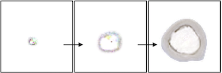

Studying Growth with Neural Cellular Automata
=======

A minimalist and high-performance implementation of [Neural Cellular Automata](https://distill.pub/2020/growing-ca/). We modify the code in order to reproduce some growth motifs seen in nature.

Blog post: [greydanus.github.io/2021/05/07/studying-growth/](https://greydanus.github.io/2021/05/07/studying-growth/)

Run in your browser:
--------
### [**Minimalist** ✅](https://colab.research.google.com/drive/13wCM9OV2JR004zFvh7zPgUxrga8sU4d1)
A self-contained Neural Cellular Automata Implementation (150 lines of PyTorch). Reimplements all the methods described in [distill.pub/2020/growing-ca/](https://distill.pub/2020/growing-ca/) using the same hyperparameters. Written in PyTorch instead of TensorFlow.

### [**Rose**](https://colab.research.google.com/drive/1TgGN5qjjH6MrMrTcStEkdHO-giEJ4bZr#scrollTo=k-2PCTfGI-pq)
Grow a 64x64 rose using the code in this GitHub repo. Scales up to 70x70 and 100s of timesteps, which is nearly double the size of the model published in Distill.

### [**Multiclass** ✅](https://colab.research.google.com/drive/1vG7yjOHxejdk_YfvKhASanNs0YvKDO5-)
Train a neural CA that can grow from a single pixel into to one of three different flowers depending on the initial seed vector. From a dynamical systems perspective, we are training a model that has three different basins of attraction, one for each flower. The initial seed determines which basin the system ultimately converges to. Analogy to DNA (specific flower) vs cellular mechanics (shared across flower species).

### [**Nautilus**](https://colab.research.google.com/drive/1DUFL5glyej725r8VAYDZIFrWvpR6a6-0)
Grow a Nautilus shell. The neural CA learns to implement a fractal growth pattern which is mostly rotation and scale invariant. The technical term for this pattern is _[gnomonic growth](https://www.geogebra.org/m/waR6eVCQ)_.

### [**Newt**](https://colab.research.google.com/drive/1fbakmrgkk1y-ZXamH1mKbN1tvkogNrWq)
Graft a newt's eye onto its belly in homage to [Lazzaro Spallanzani](https://en.wikipedia.org/wiki/Lazzaro_Spallanzani), who did this with real newts in the 1700s.

### [**Bone** ✅](https://colab.research.google.com/drive/1qQcztNsqyMLLMB00CVRxc0Pm7ipca0ww?usp=sharing)
In this experiment we simulate bone growth. Bone growth is interesting because it uses apoptosis (programmed cell death) in order to produce a hollow area in the center of the bone. We see something analogous happen in our model, with a circular tan frontier that gradually expands outwards until it reaches the size of the target image.

### [**Worm v1**](https://colab.research.google.com/drive/1wg-PKNwPA5yNzcuyBomZ6IT3Fx2xrewp) [Worm v2](https://colab.research.google.com/drive/1hE8Vxqsf_PZhSitQP1dSg-K022T3jOkK)
In this experiment we grow some simply worm shapes. The idea was to study the dynamics of growth from a point. Growth from a point, as opposed to even growth throughout, happens with worms (growth happens just behind the head), hair follicles (growth happens just below the skin), and horns (growth happens just above the skull)

Dependencies
--------
 * NumPy
 * SciPy
 * PyTorch