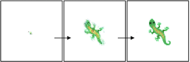
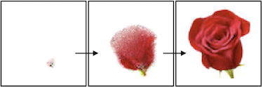

Studying Growth with Neural Cellular Automata
=======

Blog: [greydanus.github.io/2021/05/07/studying-growth/](https://greydanus.github.io/2021/05/07/studying-growth/)

Run in your browser:
--------
 * [**Minimalist**: a self-contained Neural Cellular Automata Implementation (150 lines of PyTorch)](https://colab.research.google.com/drive/13wCM9OV2JR004zFvh7zPgUxrga8sU4d1)

 
 * [[looks ok] **Rose**: grow a 64x64 rose](https://colab.research.google.com/drive/1TgGN5qjjH6MrMrTcStEkdHO-giEJ4bZr#scrollTo=k-2PCTfGI-pq)

 
 * [[looks ok] **Multiclass**: train a single model to grow different flowers (depending on the initial seed)](https://colab.research.google.com/drive/1vG7yjOHxejdk_YfvKhASanNs0YvKDO5-)

 
 * [**Nautilus**: grow a Nautilus shell](https://colab.research.google.com/drive/1DUFL5glyej725r8VAYDZIFrWvpR6a6-0) (a fractal growth pattern with rotation and scale invariance)

 
 * **Worms**: grow a worm [(moving reference frame)](https://colab.research.google.com/drive/1wg-PKNwPA5yNzcuyBomZ6IT3Fx2xrewp) [(fixed reference frame)](https://colab.research.google.com/drive/1hE8Vxqsf_PZhSitQP1dSg-K022T3jOkK)

 
 * [[looks ok] **Newt**: graft a newt's eye onto its belly](https://colab.research.google.com/drive/1fbakmrgkk1y-ZXamH1mKbN1tvkogNrWq) in homage to [Lazzaro Spallanzani](https://en.wikipedia.org/wiki/Lazzaro_Spallanzani)

 
 * [**Bone**: Osteoblasts and osteoclasts](https://colab.research.google.com/drive/1qQcztNsqyMLLMB00CVRxc0Pm7ipca0ww?usp=sharing)

 

Overview
--------

We rewrite code from [Growing CA Distill](https://distill.pub/2020/growing-ca/) PyTorch and modify it in a few ways so as to model a few different patterns of growth seen in nature.

Dependencies
--------
 * NumPy
 * SciPy
 * PyTorch